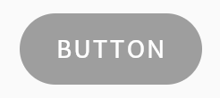
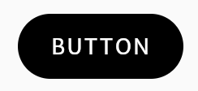
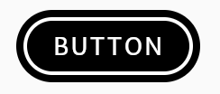
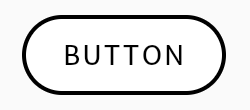

# Atoms

Here you will find the list of available atoms to build your components.

## Button

Indicate available action to the user

### Properties

| Name          | Type        | Default value | Description                                |
| ------------- | ----------- | ------------- | ------------------------------------------ |
| **text**      | String      | '' (empty)    | Text displayed in the center of the button |
| **onPressed** | Function()? | null          | method executed when button is tapped.     |

### States

The following table shows how different Button states are displayed.
| State | Result |
| ----- | ------ |
| Disabled |  |
| Idle (Enabled) |  |
| Hovered and Focused |  |
| Pressed and Selected |  |

### Usage

`Button` is a _Stateless Widget_ that represent the generic button concept with style automatically applied. Use it in the build method like:

```Dart
Button(
    text: 'Button',
    onPressed: () => print('Button has been pressed'),
)
```
